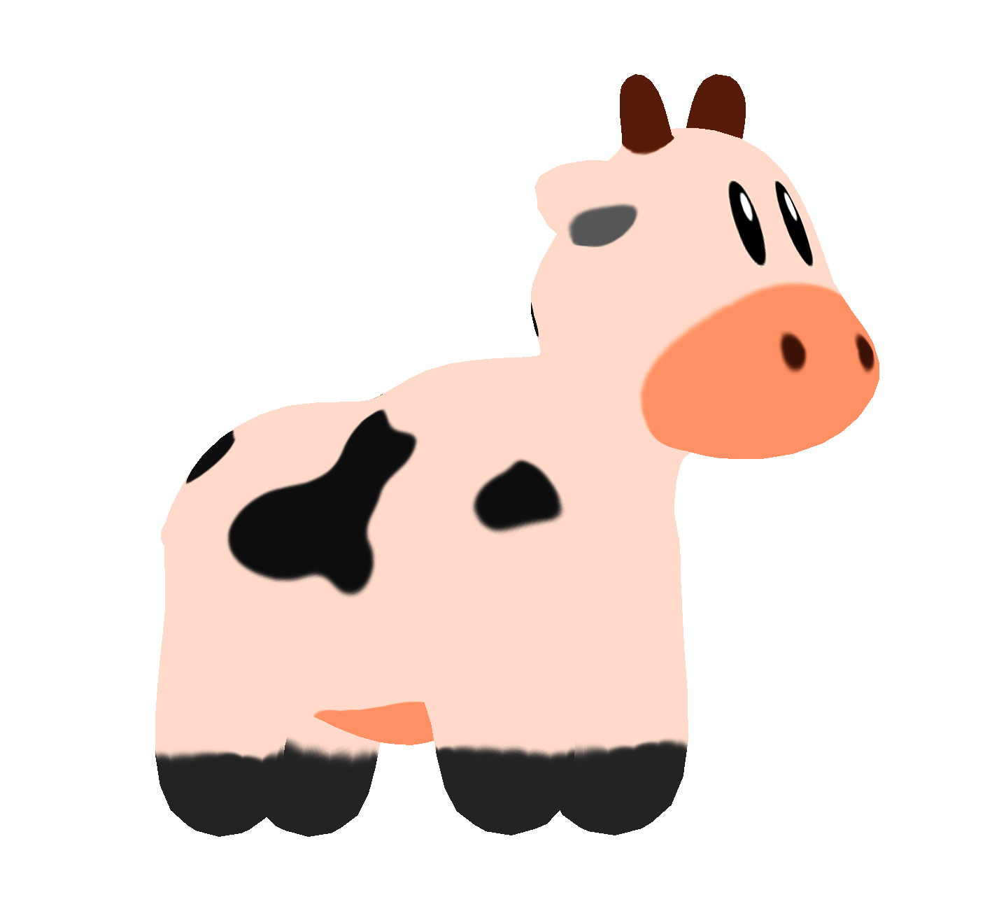
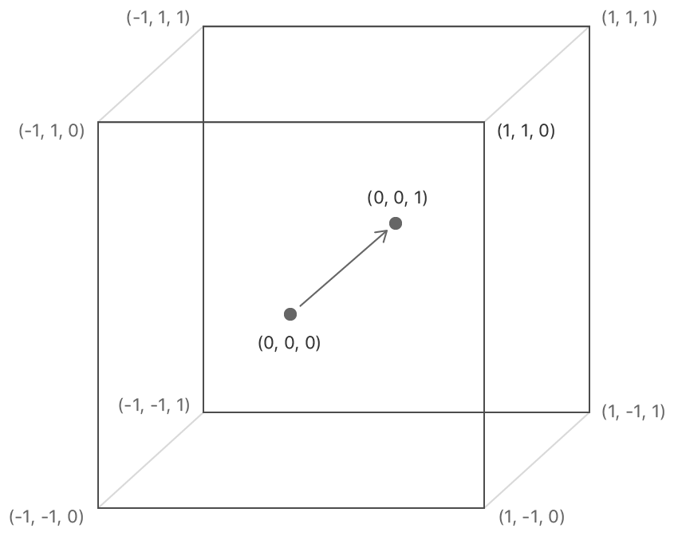

Rasterization With Metal
=================

What I've implemented
---------------

1. Three Different Shading + Texture Mapping
The following results are exported from Metal debugging tool. Here's the results is in orthographic view:

shader type | image
- | -
wireframe | 
flatshading | 
per-vertex shading | 
texture mapping | 

2. Perspective View

shader type | image
- | -
wireframe | 
flatshading | 
per-vertex shading | 
texture mapping | 

3. Object Transformation
The following results are produced by screen recording tool. The actual annimation is much smoother.

shader type | image
- | -
wireframe | 
flatshading | 
per-vertex shading | 
texture mapping | 

What's different about Metal?
----------------

Overall, the rasterizer we used during the lab is very similar to modern graphic API, at least Metal. It indeed helped me to understand how a graphic API works and how to use a graphic API. However, I still encountered some problems during development because of the small differences between Metal and our rasterizer used in lab. According to the information I checked, some differences also exist between Metal and OpenGL.

1. Normalized device coordinate system/Canonical view volume [1]

Instead of a 2x2x2 box, the normalized device coordinate system in Metal is 2x2x1.

2. Texture coordinate [2]

When I was doing texture mapping, I found the texture was weirdly wrong. The reason is the model I downloaded use the coordinate system of which the origin is at bottom-left, whereas the origin in Metal is at top-left.

References
-----------
[1]Using a Render Pipeline to Render Primitives. (2020). Retrieved 22 December 2020, from https://developer.apple.com/documentation/metal/using_a_render_pipeline_to_render_primitives?language=objc

[2]Creating and Sampling Textures. (2020). Retrieved 22 December 2020, from https://developer.apple.com/documentation/metal/creating_and_sampling_textures

