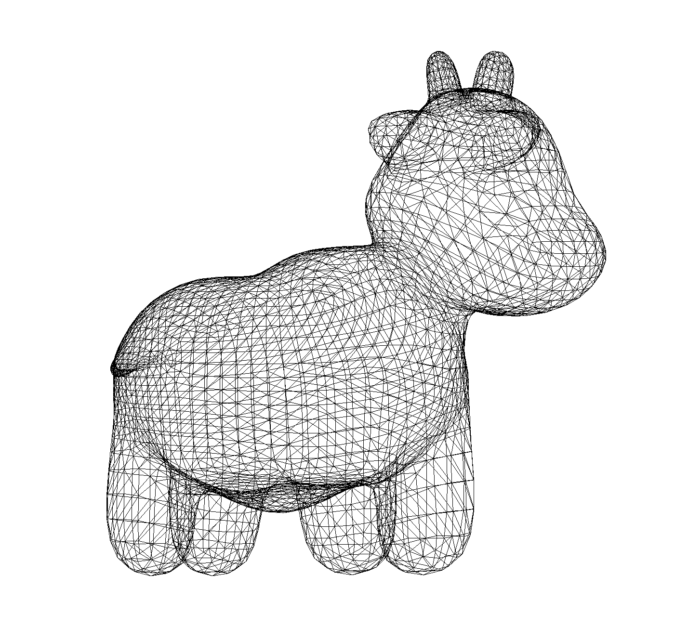

Rasterization With Metal
=================

The following results are exported from Metal debugging tool. 

1. Orthographic View

| type | wireframe | flatshading | per-vertex shading | texture mapping |
| - | - | - | - | - |
|image|  | | | |

2. Perspective View

| type | wireframe | flatshading | per-vertex shading | texture mapping |
| - | - | - | - | - |
|image|  | | | |

3. Object Transformation
The following results are produced by screen recording tool. 

| type | wireframe | flatshading | per-vertex shading | texture mapping |
| - | - | - | - | - |
|image|  | | | |

References
-----------
[1]Using a Render Pipeline to Render Primitives. (2020). Retrieved 22 December 2020, from https://developer.apple.com/documentation/metal/using_a_render_pipeline_to_render_primitives?language=objc

[2]Creating and Sampling Textures. (2020). Retrieved 22 December 2020, from https://developer.apple.com/documentation/metal/creating_and_sampling_textures

